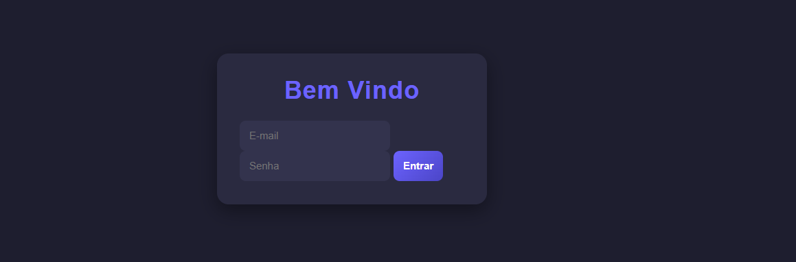
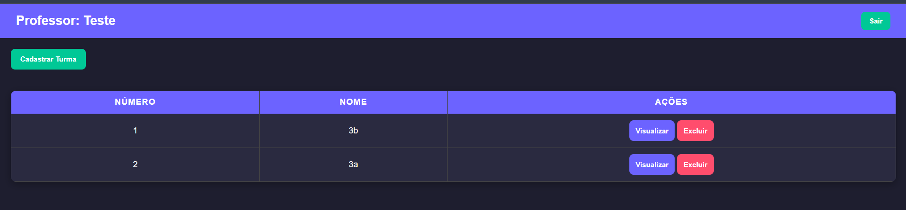
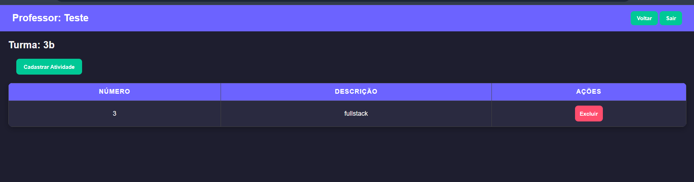

# Escola Avaliação

## Requisitos de Infraestrutura

### Editor
- Visual Studio Code (VSCode)

### SGBD (Banco de Dados)
- MySQL - xampp

### Servidor de Aplicação
- Node.js v18.x (LTS)

### Linguagens Utilizadas
- JavaScript (Node.js – back-end)
- HTML, CSS e JavaScript (front-end simples)

---
    
## Prints das Telas Principais

### Tela de Login


### Tela de Professor


### Tela de Atividades


---

## Tutorial de Execução

### Back-end
1. Entre na pasta `api/escolaavaliacao`
2. Instale as dependências:
   ```bash
   npm install
   npx prisma migrate dev
   npm start
3. O backend estará disponivel!

### Front-end//web
1. Entre na pasta `web`
2. Instale as dependências:
   ```bash
   npm install
   npm run dev
3. Execute o arquivo `index.html` com live server!
